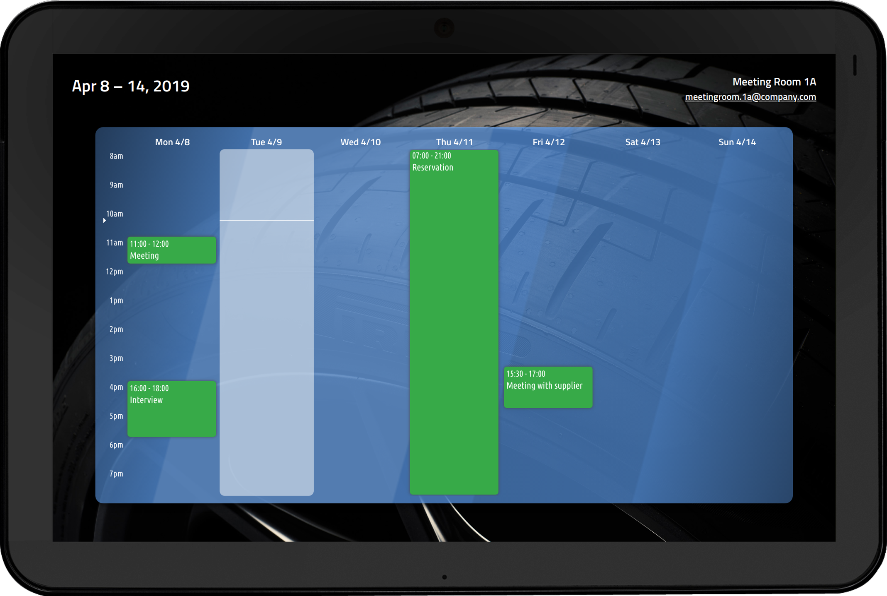

## Meeting Room Calendar Display
#### Web-based stylish bookings display for Exchange mailboxes

- Frontend: FullCalendar
- Backend: EWS Java API + Tomcat
- Client Recommended: Chrome web browser on Android tablets with stable connection to the hosting server

### Implementation Considerations
- On the client, a local html file is used as the parent frame so the scripts on the page will still work (to some extent) in case of network problems. There should be a different file for each meeting room. The local html file passes the required parameter `mailbox` to the web service. The address looks like this: `http://your-deployment-server/exchange-calendar-display/?mailbox=meetingroom@yourcompany.com`. The mailbox parameter can also be anything that is resolvable in `microsoft.exchange.webservices.data.core.ExchangeService.resolveName()` method. 
- The web service will be using the account configured in the `config.xml` file to communicate with Exchange. In order to correctly display events for a meeting room, all information specific to the environment in your organization need to be configured. The account needs to be delegated access on the mailboxes in question.
- Although the solution works with WiFi, to reduce unnecessary maintenance overhead, it is recommended to use tablets with Ethernet connection and disable WiFi. There are Android tablets with PoE support on the market that are perfect for this scenario.
- On Android devices, a shell script is created to greatly increase the reliability of the display by cancelling prompts that might appear on screen from time to time, enabling remote debugging, applying customizations on boot such as muting and disabling sleep, protecting the battery and so on. The script is found at `web/download/MRCD.sh`. Refer to the [manual page](MANUAL_Android_Setup.md) for more details and the setup of the script on Android devices.
